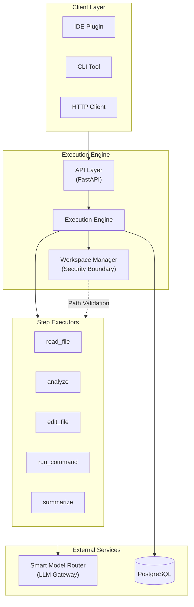
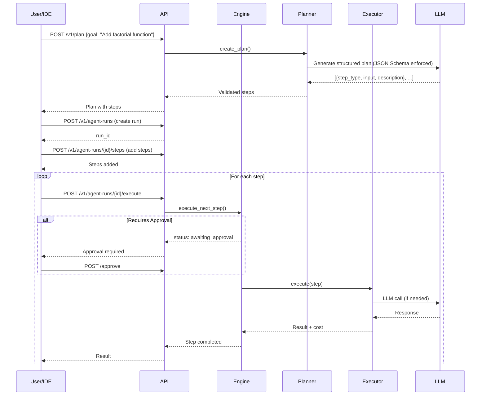
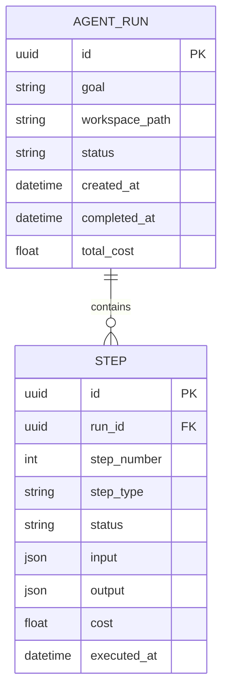
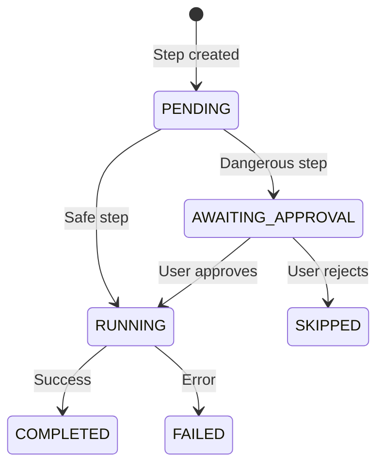
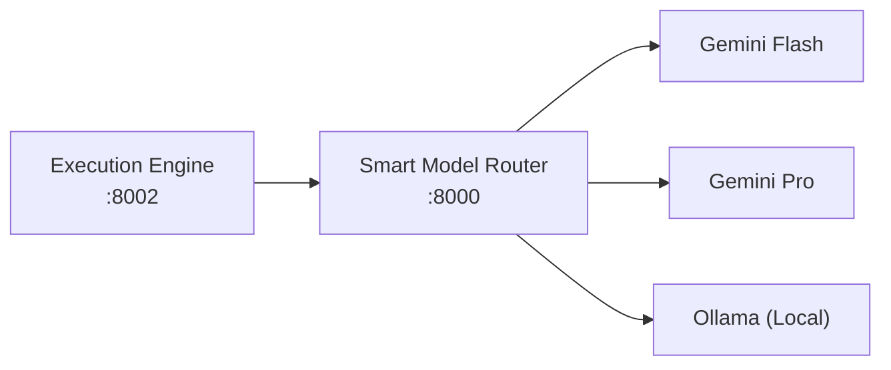

# Deterministic Agent Execution Engine

> **Transform unpredictable AI agents into enterprise-ready, auditable systems with human-in-the-loop control.**

---

## 🎯 The Problem We Solve

**AI agents are powerful but dangerous in production.** They can:
- Execute code without approval
- Modify files unexpectedly  
- Run commands with unintended consequences
- Cost thousands in API calls without visibility

**Organizations need AI automation but can't accept the risk.** They ask:
- *"How do I know what the AI did?"*
- *"Can I approve changes before they happen?"*
- *"What if it goes rogue and costs me money?"*
- *"How do I debug when things go wrong?"*

---

## 💡 The Solution: Determinism + Control

The **Deterministic Agent Execution Engine** decomposes AI tasks into **discrete, auditable, approvable steps**:

| Traditional AI Agent | This Engine |
|---------------------|-------------|
| ❌ Black box execution | ✅ Step-by-step visibility |
| ❌ Immediate, irreversible actions | ✅ Approval workflow before execution |
| ❌ Unpredictable costs | ✅ Per-step cost tracking |
| ❌ "Trust me" model | ✅ Full audit trail |
| ❌ All or nothing | ✅ Pause, resume, rollback |

---

## 🏢 Business Value

### For Engineering Leaders
- **Reduced Risk**: Approve file edits and commands before execution
- **Cost Control**: Track LLM costs per step, per run, per project
- **Compliance Ready**: Full audit trail for SOC2/ISO requirements

### For AI Product Managers
- **Predictable Behavior**: Same input = same execution plan
- **Debug Visibility**: Know exactly where things went wrong
- **Incremental Rollout**: Run steps manually before full automation

### For Developers
- **Clean API**: RESTful endpoints for IDE/tool integration
- **Extensible**: Add custom step types easily
- **Type-Safe**: Pydantic schemas, async Python, PostgreSQL

---

## 🏗️ Architecture Overview



---

## 🔄 Execution Flow



---

## 📐 Data Model



---

## 🔧 Step Types

| Type | Purpose | Input | Requires Approval |
|------|---------|-------|-------------------|
| `read_file` | Read file contents | `{path}` | ❌ No |
| `analyze` | LLM reasoning/analysis | `{instruction}` | ❌ No |
| `edit_file` | Create/modify files | `{path, new_content}` | ✅ Yes |
| `run_command` | Execute shell commands | `{command, working_dir}` | ✅ Yes |
| `summarize` | Generate summaries | `{instruction}` | ❌ No |

---

## 🛡️ Security Model

### Workspace Isolation

All file operations are **sandboxed** to a designated workspace directory:

```python
# Attempts to escape are blocked
workspace.validate_path("../../etc/passwd")  
# Raises: WorkspaceSecurityError
```

### Approval Workflow

Dangerous operations require explicit approval:



---

## 🚀 Quick Start

### Prerequisites
- Python 3.11+
- PostgreSQL 15+
- [Smart Model Router](https://github.com/yourusername/smart-model-router) (LLM gateway)

### Installation

```bash
# Clone the repository
git clone https://github.com/yourusername/deterministic-agent-engine.git
cd deterministic-agent-engine

# Create virtual environment
python -m venv .venv
.venv\Scripts\activate  # Windows
source .venv/bin/activate  # Linux/Mac

# Install dependencies
pip install -e .

# Configure environment
cp .env.example .env
# Edit .env with your settings

# Run database migrations
alembic upgrade head

# Start the server
uvicorn src.main:app --reload --port 8002
```

### API Documentation

Once running, visit: **http://localhost:8002/docs**

---

## 📡 API Reference

### Planning

```bash
# Generate a plan from a goal
POST /v1/plan
{
  "goal": "Add a factorial function to utils.py",
  "workspace_files": ["utils.py"]
}

# Response: Structured steps guaranteed by JSON Schema
{
  "success": true,
  "steps": [
    {"step_type": "read_file", "input": {"path": "utils.py"}, "description": "..."},
    {"step_type": "edit_file", "input": {...}, "description": "..."}
  ],
  "cost": {"model": "gemini-2.0-flash-exp", "estimated_cost": 0.0001}
}
```

### Execution

```bash
# Create a run
POST /v1/agent-runs
{"goal": "Refactor auth module", "workspace_path": "./workspace"}

# Add steps
POST /v1/agent-runs/{run_id}/steps
{"step_type": "read_file", "input": {"path": "auth.py"}}

# Execute next step
POST /v1/agent-runs/{run_id}/execute

# Approve dangerous step
POST /v1/agent-runs/{run_id}/steps/{step_id}/approve
```

---

## 🔌 Integration with Smart Model Router

This engine uses the **Smart Model Router** for LLM operations:

- **`/v1/complete`** - Free-form text completion
- **`/v1/structure`** - Guaranteed JSON output with schema enforcement



The router handles:
- Automatic model selection based on complexity
- Cost optimization (up to 90% savings)
- Caching (exact + semantic)
- Retry and fallback logic

---

## 📊 Cost Tracking

Every step tracks LLM costs:

```bash
GET /v1/agent-runs/{run_id}/cost

{
  "run_id": "...",
  "total_cost": 0.0023,
  "total_tokens": 4521,
  "steps": [
    {"step_number": 1, "cost": 0.0001, "model": "gemini-2.0-flash-exp"},
    {"step_number": 2, "cost": 0.0022, "model": "gemini-2.0-flash-exp"}
  ]
}
```

---

## 🧪 Testing

```bash
# Run all tests
pytest

# Run with coverage
pytest --cov=src --cov-report=html

# Run specific test file
pytest tests/test_integration.py -v
```

---

## 📁 Project Structure

```
src/
├── api/
│   ├── routes.py          # FastAPI endpoints
│   ├── schemas.py         # Pydantic request/response models
│   └── dependencies.py    # Dependency injection
├── db/
│   ├── models.py          # SQLAlchemy ORM models
│   └── session.py         # Database connection
├── engine/
│   └── engine.py          # Core execution engine
├── executors/
│   ├── base.py            # Base executor class
│   ├── read_file.py       # File reading
│   ├── analyze.py         # LLM analysis
│   ├── edit_file.py       # File editing
│   ├── run_command.py     # Command execution
│   └── summarize.py       # Summarization
├── services/
│   ├── workspace.py       # Workspace security
│   ├── smart_router.py    # LLM client
│   └── planner.py         # Goal → Steps conversion
├── config.py              # Settings management
└── main.py                # Application entry point
```

---

## 🛣️ Roadmap

- [ ] **Streaming execution** - Real-time step output
- [ ] **Rollback support** - Undo completed steps
- [ ] **Multi-workspace** - Parallel isolated workspaces
- [ ] **Plugin system** - Custom executor types
- [ ] **Web UI** - Visual run management
- [ ] **Metrics dashboard** - Cost and usage analytics

---

## 📄 License

MIT License - See [LICENSE](LICENSE) for details.

---

<p align="center">
  <strong>Built for enterprises that need AI automation without the chaos.</strong>
</p>
