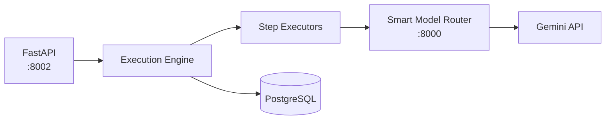
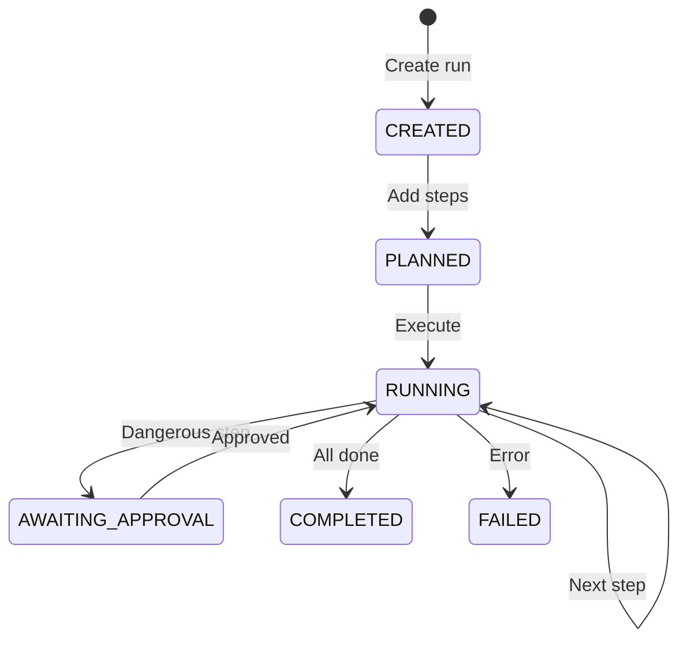

# Deterministic Agent Execution Engine

A proof-of-concept execution engine that breaks down AI agent tasks into discrete, auditable steps with optional human approval.

## Overview

This project explores an approach to AI agent execution where:

- Tasks are decomposed into individual **steps** (read file, analyze, edit, etc.)
- Each step is logged with inputs, outputs, and costs
- Dangerous operations (file edits, commands) require approval before execution
- All execution happens within a sandboxed workspace

This is a **learning project / MVP** - not production-ready software.

## Architecture



### Components

| Component | Description |
|-----------|-------------|
| **API Layer** | FastAPI endpoints for runs, steps, planning |
| **Execution Engine** | Orchestrates step execution and state management |
| **Step Executors** | Individual handlers for each step type |
| **Workspace Manager** | Sandboxes file operations to a directory |
| **Planner Service** | Converts goals into step plans via LLM |

## Step Types

| Type | What it does | Needs Approval |
|------|--------------|----------------|
| `read_file` | Read a file from workspace | No |
| `analyze` | Ask LLM to reason about something | No |
| `edit_file` | Create or modify a file | Yes |
| `run_command` | Execute a shell command | Yes |
| `summarize` | Generate a summary | No |

## Setup

### Requirements

- Python 3.11+
- PostgreSQL
- [Smart Model Router](https://github.com/yourusername/smart-model-router) running on port 8000

### Installation

```bash
# Clone and setup
git clone https://github.com/yourusername/deterministic-agent-engine.git
cd deterministic-agent-engine
python -m venv .venv
.venv\Scripts\activate  # Windows

# Install
pip install -e .

# Configure
cp .env.example .env
# Edit .env with your database URL and Smart Router API key

# Database
alembic upgrade head

# Run
uvicorn src.main:app --reload --port 8002
```

## Usage

### 1. Create a Run

```bash
curl -X POST http://localhost:8002/v1/agent-runs \
  -H "Content-Type: application/json" \
  -d '{"goal": "Add a function to utils.py", "workspace_path": "workspace"}'
```

### 2. Add Steps

```bash
curl -X POST http://localhost:8002/v1/agent-runs/{run_id}/steps \
  -H "Content-Type: application/json" \
  -d '{"step_type": "read_file", "input": {"path": "utils.py"}}'
```

### 3. Execute

```bash
curl -X POST http://localhost:8002/v1/agent-runs/{run_id}/execute
```

### 4. Approve (if needed)

```bash
curl -X POST http://localhost:8002/v1/agent-runs/{run_id}/steps/{step_id}/approve
```

### Or use the Planner

```bash
curl -X POST http://localhost:8002/v1/plan \
  -H "Content-Type: application/json" \
  -d '{"goal": "Add factorial function", "workspace_files": ["utils.py"]}'
```

## API Docs

Swagger UI available at: http://localhost:8002/docs

## Project Structure

```
src/
├── api/           # FastAPI routes and schemas
├── db/            # SQLAlchemy models
├── engine/        # Execution engine
├── executors/     # Step type handlers
├── services/      # Workspace, LLM client, planner
├── config.py      # Settings
└── main.py        # Entry point
```

## Execution Flow



## Limitations

- No streaming output
- No rollback/undo
- Single workspace at a time
- Basic error handling
- Minimal test coverage

## Dependencies

- **FastAPI** - Web framework
- **SQLAlchemy** - ORM
- **Pydantic** - Validation
- **httpx** - HTTP client
- **Smart Model Router** - LLM gateway

## License

MIT
