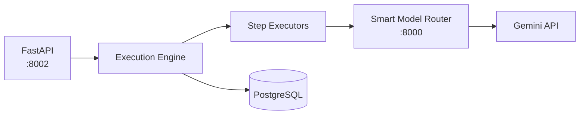
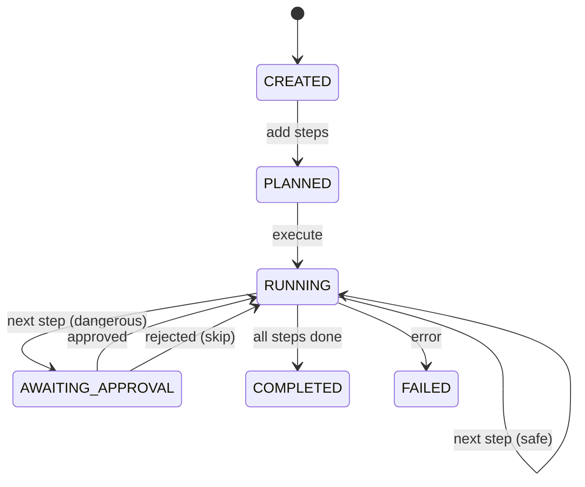

# Deterministic Agent Execution Engine

A minimal state machine implementation for AI agent execution, built to understand the internals of agentic systems for future work on an **Agentic-first IDE**.

## Why This Exists

Modern AI coding assistants (Cursor, Windsurf, etc.) execute agent workflows internally but don't expose how. This project is an exploration of:

- How to decompose AI tasks into **discrete, trackable steps**
- How to implement **human-in-the-loop approval** for dangerous operations
- How to build **auditable execution** with full input/output logging
- How state machines work in agentic contexts

### Why Not LangGraph?

Tools like LangGraph are powerful but introduce vendor lock-in. Cursor and Windsurf notably avoid external agent frameworks to maintain control over their execution model. This project takes the same approach - a minimal, dependency-light implementation to understand the fundamentals.

## What It Does

```
Goal: "Add a factorial function to utils.py"
         ↓
   [Planner Service]
         ↓
Step 1: read_file(utils.py)      → executed automatically
Step 2: analyze("where to add")  → executed automatically  
Step 3: edit_file(utils.py, ...) → ⚠️ requires approval
Step 4: summarize("changes")     → executed automatically
```

Each step is logged with inputs, outputs, timing, and LLM costs.

## Architecture



### Components

| Component | Description |
|-----------|-------------|
| **Execution Engine** | State machine that orchestrates step execution |
| **Step Executors** | Individual handlers for each step type |
| **Workspace Manager** | Sandboxes file operations to a directory |
| **Planner Service** | Converts goals into step plans via LLM |

## Step Types

| Type | Purpose | Approval Required |
|------|---------|-------------------|
| `read_file` | Read file contents | No |
| `analyze` | LLM reasoning | No |
| `edit_file` | Create/modify files | **Yes** |
| `run_command` | Shell execution | **Yes** |
| `summarize` | Generate summary | No |

## State Machine



## Setup

### Requirements

- Python 3.11+
- PostgreSQL
- [Smart Model Router](https://github.com/Asirwad/smart-model-router) on port 8000

### Installation

```bash
git clone https://github.com/Asirwad/Dterministic-agent-execution-engine-for-agenticIDEs
cd Deterministic-agent-execution-engine-for-agenticIDEs

python -m venv .venv
.venv\Scripts\activate  # Windows

pip install -e .
cp .env.example .env    # Configure database + API keys
alembic upgrade head
uvicorn src.main:app --reload --port 8002
```

## Usage

### Create and Execute a Run

```bash
# 1. Create run
curl -X POST http://localhost:8002/v1/agent-runs \
  -H "Content-Type: application/json" \
  -d '{"goal": "Review code quality", "workspace_path": "workspace"}'

# 2. Add steps
curl -X POST http://localhost:8002/v1/agent-runs/{run_id}/steps \
  -H "Content-Type: application/json" \
  -d '{"step_type": "read_file", "input": {"path": "main.py"}}'

# 3. Execute
curl -X POST http://localhost:8002/v1/agent-runs/{run_id}/execute

# 4. Approve if needed
curl -X POST http://localhost:8002/v1/agent-runs/{run_id}/steps/{step_id}/approve
```

### Or Use the Planner

```bash
curl -X POST http://localhost:8002/v1/plan \
  -H "Content-Type: application/json" \
  -d '{"goal": "Add factorial function", "workspace_files": ["utils.py"]}'
```

## Project Structure

```
src/
├── api/           # FastAPI routes and schemas
├── db/            # SQLAlchemy models (AgentRun, Step)
├── engine/        # State machine implementation
├── executors/     # Step type handlers
├── services/      # Workspace, LLM client, planner
└── main.py
```

## Limitations

This is a learning project, not production software:

- No streaming output
- No rollback/undo
- Single workspace at a time
- Minimal error handling
- Basic test coverage

## API Documentation

Swagger UI: http://localhost:8002/docs

## License

MIT
